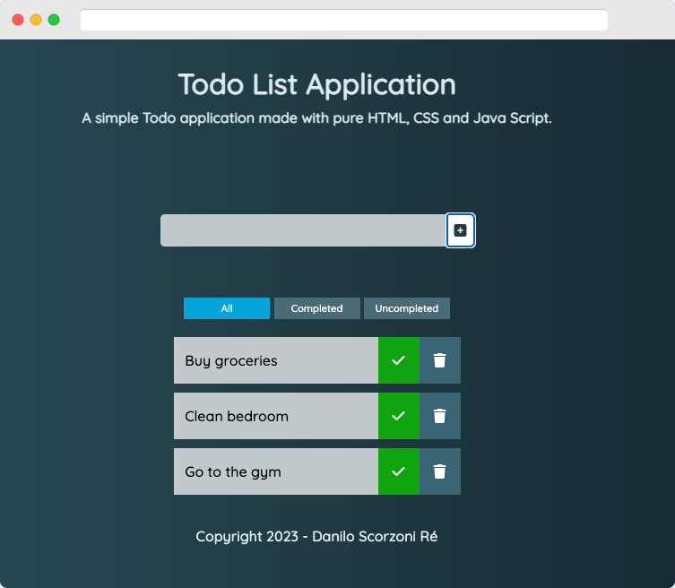

# TodoList Application

This is a simple application developed in HMTL, CSS and Java Script that manages a list of things to do that can be created using a form and managed through delete and completed buttons.



## Functionalities

1. Use the text input to add new activities into the todo list.
2. Use the filter buttons (All, Completed, Uncompleted) to filter on activities according to their status.
3. Mark activities as Completed and they will receive a CSS effect.
4. Click on trash icon to delete the todo.

The list is not persistent, which means that when you refresh your browser, the list will start from scratch again.

## Why did I do this project?

As I go into my journey to learn Front End Development, this project was a very nice one due to the simplicity of the task. So, I was able to practice some CSS skills to develop the webdesign of this app (thanks [developedbyed](https://www.youtube.com/watch?v=Ttf3CEsEwMQ&t=2368s) for the inspiration!) and also to apply the new knowledge that I acquired in vanilla Java Script.

## How to see it live

If you want test the app, you just have to download the files and run locally in your browser. No packages are necessary because it's a simple app in HTML, CSS and Java Script. Use git-clone to download this repository to your machine:

```
git clone https://github.com/dscorzoni/todolistjs
```

Then just open index.html in your browser of preference.

**Have fun!**
